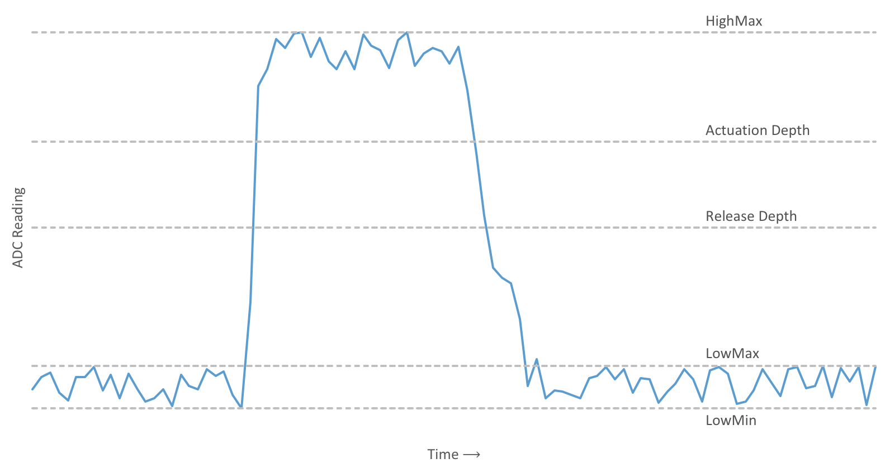

This is an incomplete guide for building a custom Topre keyboard: specifically
the PCB, plate, and firmware. It is an accumulation of information gained
through these projects:
[designing a custom Topre board](https://deskthority.net/workshop-f7/designing-a-custom-topre-board-t11734.html),
[Split HHKB - Realforce/TypeHeaven mod](https://deskthority.net/workshop-f7/another-custom-split-hand-topre-board-need-your-input-t14769.html).

If anything is unclear or needs adding, let me know.

Thanks to [hasu's research](https://github.com/tmk/tmk_keyboard/tree/master/keyboard/hhkb/doc)
for starting this all off.

**Table of contents**

1. [Circuitry](#circuitry)
    1. [Basic schematic](#basic-schematic)
    2. [Drain pin](#drain-pin)
    3. [Practical considerations](#practical-considerations)
        1. [Parasitic capacitance](#parasitic-capacitance)
        2. [Other notes](#other-notes)
    4. KiCad files
2. [Hardware (case/plate)](#hardware-caseplate)
3. [Firmware](#firmware)
    1. [Basic read procedure](#basic-read-procedure)
    2. [Normalisation](#normalisation)
    3. [Calibration](#calibration)
        1. [Overview](#overview)
        2. [Calibration procedure](#calibration-procedure)
        3. [A warning](#a-warning)
    4. [Handling the depths](#handling-the-depths)
        1. [Digital conversion](#digital-conversion)
        2. [Analog](#analog)
    5. [Example](#example)


# Circuitry

## Basic schematic

The method I use to sense key depression is rather simple. In tests that I
have done it works well provided some calibration is performed in the firmware
to normalise the readings.

The matrix crossing points of a Topre keyboard are essentially variable
capacitors which connect a "strobe" line to a "read" line. The strobe and the
read lines form the electrodes directly on the PCB, and the conical spring
under the dome couples them together, creating a variable capacitor with the
range 0 ~ 6 pF (roughly). The strobe lines are just digital signals from a
digital out pin of the microcontroller. The read lines are dealt with in the
following schematic:


Each read line is pulled to ground with an individual 22k resistor, and fed
into an analog multiplexer. After selecting a read line on the multiplexer, the
microcontroller strobes a column and a small voltage pulse can be seen on the
selected read line, larger pulses correspond to greater key depression.

The selected read line is connected to the capacitor C1, which causes the read
line to behave like a simple RC decay circuit. The value can be chosen given
the following formula:

```
                                       Capacitance of key we are sensing
Peak output voltage = Input voltage * -----------------------------------
                                             Total row capacitance
```

Here the input voltage is `Vdd`. The total row capacitance (to ground) consists
of C1 plus the capacitance of all the keys in the row. As such it is clear that
choosing a large value for C1 (compared to key capacitance) is important so
that our reading is not significantly altered due to other keys on the row
being depressed. We can't just make C1 enormous though, because it drops the
peak output voltage which ultimately contributes to a higher noise level. I
found 1 nF to be a good value.

Ignoring the "drain pin" for now, the read line passes through a current
limiting resistor into a non inverting amplifier. The purpose of this is to
provide a clean signal boost back into the range of 0 - 3.3V. The gain is given
by `1 + R2 / R4` which in this case is around 200. It also serves to protect
the microcontroller from negative voltages which can happen when the strobe
line returns to ground. The output of the amplifier should connect to an ADC
pin of the microcontroller.

## Drain pin

With the selected read line forming an RC circuit we can see that the time for
it to relax to ground is simply governed by `5 * RC time constant`. The time
constant is just `R * C`, which in our case gives a total relax time of
`5 * 22k Ohm * 1 nF ~ 100 us`. Bearing in mind that we must wait for the matrix
to relax to ground before reading the next key, this translates to taking 100
us per key of the keyboard - giving us a polling rate less than 1000 Hz for
keyboards with more than 10 keys. In order to fix this, we just connect the
read line to the pin of the microcontroller through a current limiting 1k
resistor R1. This pin should be floating during the strobe and read process,
but after we have captured the reading in the ADC (takes around 5 us)
it can be grounded, reducing the resistance R according to the parallel
resistor formula:

```
  1     1       1
 --- = ---- + -----
  R     R1     22k
```

which gives `R ~ 950 Ohms` for our chosen values. Recalculating the relax time
now gives `5 * 950 Ohms * 1 nF ~ 5 us`. This would allow 1000 Hz polling for
even 100 key keyboards.

## Practical considerations

## Parasitic capacitance

When routing any analog lines (and to some extent the digital strobe lines)
care must be taken to reduce parasitic capacitance due to the low signal level.
The lines must be surrounded by a ground pour and have a ground plane on
surrounding layers. Crossing tracks should ideally occur with a ground plane
between them, but this requires a 4 layer PCB. 2 layers is perfectly fine, as
long as you ensure traces cross at right angles and do so as little as
possible. Basically just don't run the strobe lines (or other digital lines)
close to the analog lines where you can avoid it! Study the Topre PCBs to see
the careful routing of the matrix.

## Other notes

Any unused inputs of the multiplexer should be grounded to prevent additional
sources of noise: this goes for any unused op amp pins too. If they are not
connected, ground them.

I found it important to use a very fast amplifier, opting for the OPA350A.
Cheaper options proved to be too slow, turning the voltage spike into more of a
voltage mound, making reading unpredictable.

# Hardware (case/plate)

The stackup is fairly simple, and is determined by the housing dimensions:

```
1.2 mm thick steel plate
3/16 inch spacers
PCB
```
TODO: hole sizes drawings, warn about Realforce control key rotation, dealing
with clones, dome cutting.

# Firmware

You will need to modify a firmware quite substantially to get your keyboard
working. Your initial choice depends on your chosen microcontroller and
preferences in firmware. You need access to an ADC and some EEPROM memory in
order to store calibration values: at least 2 bytes per key, if the stored
values take 1 byte each (uint8_t).

## Basic read procedure

Global variables
```
relaxTime (5 * R * C, include drain pin if using)
state[num reads, num strobes] a structure containing:
    depth   (current depth of key)
    pressed (whether the key is currently "pressed", see digital conversion)
```

Matrix scan
```
for each read:
    select read line on multiplexer
    delay for relaxTime
    for each strobe:
        value <- strobeRead(strobe)
        depth <- normalise(strobe, read, value)
        state->depth[read, strobe] <- depth
```

Read value on ADC
```
strobeRead(strobe):
    static lastTime
    wait until lastTime + relaxTime < current time
    float drain pin
    disable interrupts (could throw timing off)
    set strobe high
    value <- read on ADC
    set strobe low
    enable interrupts
    ground drain pin
    lastTime <- current time
    return value
```

The values which come out of the strobeRead function are assumed to be 8 bit
unsigned integers, that is, 0 to 255. This directly correlates to the voltage
of the read line, and also the capacitance of the key. Thanks to Topre's method
of using a conical spring, the capacitance of the key is linear with key
depression. So the output of strobeRead can be taken as the key depth!

Of course it isn't quite so simple, because each key will have an offset value
from ground and a different peak value when the key is fully depressed. As
such, we need to be able to rescale each key to find the true depth. For
example, if a key is reading on average 34 when unpressed and 200 when pressed,
we must rescale this into the range [0, 255]. These values should be stored in
EEPROM for each key, and can be determined by the [calibration
procedure](#calibration).

## Normalisation

See [this wikipedia article](https://en.wikipedia.org/wiki/Feature_scaling#Rescaling).
In the example procedure, we are rescaling to the range [0, 255].

Example procedure for uint8_t values, with no floating point operations
```
uint8_t normalise(strobe, read, uint8_t value):
    (calLow, calHigh) <- calibrationValues(strobe, read)
    // clamp to minimum and maximum values
    if (value < calLow)
        value <- calLow
    else if (value > calHigh)
        value <- calHigh

    uint16_t numerator   <- 0xFF * (value - calLow)
    uint8_t  denominator <- calHigh - calLow

    return (uint8_t) (numerator / denominator);
```

## Calibration

### Overview

Repeated readings from the ADC for a single key might look something like this:



This shows a full key press and release as the ADC reading crosses above the
actuation depth, and later below the release depth. We are interested in
finding the average value when a key is unpressed, and the average value when a
key is pressed, so that we can normalise values easily. The values HighMax,
LowMax, and LowMin which are marked on the plot are easily measurable (see
[calibration procedure](#calibration-procedure)) and will
allow us to calculate the averages we need. We take the noise to be

```
noise = lowMax - lowMin
```

and the signal to noise ratio to be

```
       highMax - lowMax
SNR = ------------------
             noise
```

This can be a convenient read on how good a key is. Generally we are looking
for at least SNR > 10, I've seen most values come in between 20 and 30 for the
above design.

The values lowAvg and highAvg are just

```
          lowMax + lowMin
lowAvg = -----------------
                 2
```
```
                     noise
highAvg = highMax - -------
                       2
```

These should be stored in EEPROM for the normalisation routine.

### Calibration procedure

First we determine the values lowMax and lowMin. This is simple: just leave the
keyboard untouched while scanning the matrix for a short period of time (a few
seconds should do). For each key, keep a log on the highest and lowest
measurements, this will give you lowMax and lowMin respectively.

Finding highMax can be done by scanning the matrix while the user presses each
key in turn, keeping track of the highest measurement.

That's enough for a basic calibration routine, and I have found that is all
that is required for stable measurements. To improve upon this, you might
introduce continual recalibration via a more advanced signal processing method.

### A warning

It is useful to have some sort of escape route from the main key detection
routine (for example a digital button which interrupts sending keypresses to
the host). When we are scanning the matrix at 1000Hz and you mess something up,
for example your calibration values are wrong and you are normalising sane
input values to 0 or 255 randomly, you could end up sending hundreds of
keypresses per second to the host mistakenly, and if your only method of
interrupting is via your serial connection (for example through `screen`), you
will have a bad time.

## Handling the depths

Now we know how to collect the normalised depth of each key, we must do
something with it.

### Digital conversion

The most basic method of converting a normalised key depth to a digital value
is to check if a key is deeper than the desired actuation point. This
won't work very well, and will spam the host with keypresses thanks to noisy
readings. We must introduce hysteresis in the measurement of the key depth, we
do this by storing key press state as well as depth.

A simple procedure for a single key is as follows:

```
if (not pressed and depth > actuation depth):
    pressed <- true
    send key press signal
else if (pressed and depth < release depth):
    pressed <- false
    send key release signal
```

The actuation depth should be chosen somewhere around the middle. Don't set it
too close to 0 or 255 or you risk missing presses or having false presses
thanks to noisy readings. The calibration procedure should determine the noise
levels, and you can set a buffer value accordingly (use a few times the
measured noise value for safety). As a fallback, I find that giving a buffer of
around 30 works nicely for the range 0-255. The release depth should be the
actuation depth minus this buffer value.

### Analog

Theoretically you could pipe the depth directly to an axis, be it a controller
axis or something more interesting like analog mouse keys. Noisy readings mean
you probably need to introduce a deadzone.

## Example

See [my fork of Kiibohd](https://github.com/tomsmalley/controller),
specifically Scan/SplitHHKB.
Warning: it is not complete and basically is broken, it crashes after a short
time. The Topre part works fine though, it's my hacked together interconnect
solution that is the problem.
